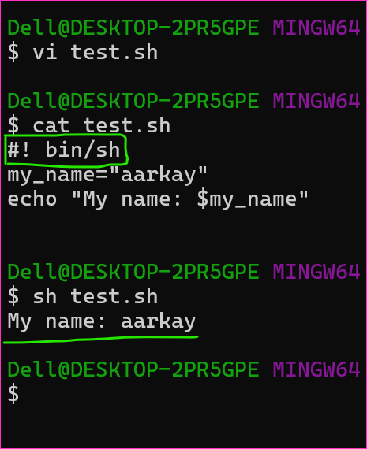

Difference b/w Bash script and Shell script
-------------------------------------------

### Bash script
* The bash script is a script that is specifically created for Bash.
* Bash scripting is a subset of shell scripting.
* The bash script is one form of shell script.
* Bash is an acronym for Bourne Again SHell and was developed by Brian Fox.
* Bash has more features as compared to Shell.
* We can use shebang, “#!/bin/sh” if we want to use sh. 
* Bash is more programmer-friendly as compared to shell.


### Shell script
* The shell script is a script that can be executed in any shell. 
* Shell scripting is a method to automate tasks as a collection of commands. 
* Shells may be one of  Korn, C shell, Bourne, Bash, etc.
* Shell is considered the original Unix shell developed by Stephen Bourne.
* Shell has fewer features as compared to Bash.
* We can use shebang, “#!/bin/bash” if we want to use Bash if available. 
* Shell is less programmer-friendly as compared to Bash.


### Examples
* Bash script
```bash
#! bin/bash 
my_name="aarkay"
echo "My name: $my_name"
```


* Shell script
```sh
#! bin/sh
my_name="aarkay"
echo "My name: $my_name"
```


Thanks for Reading!
